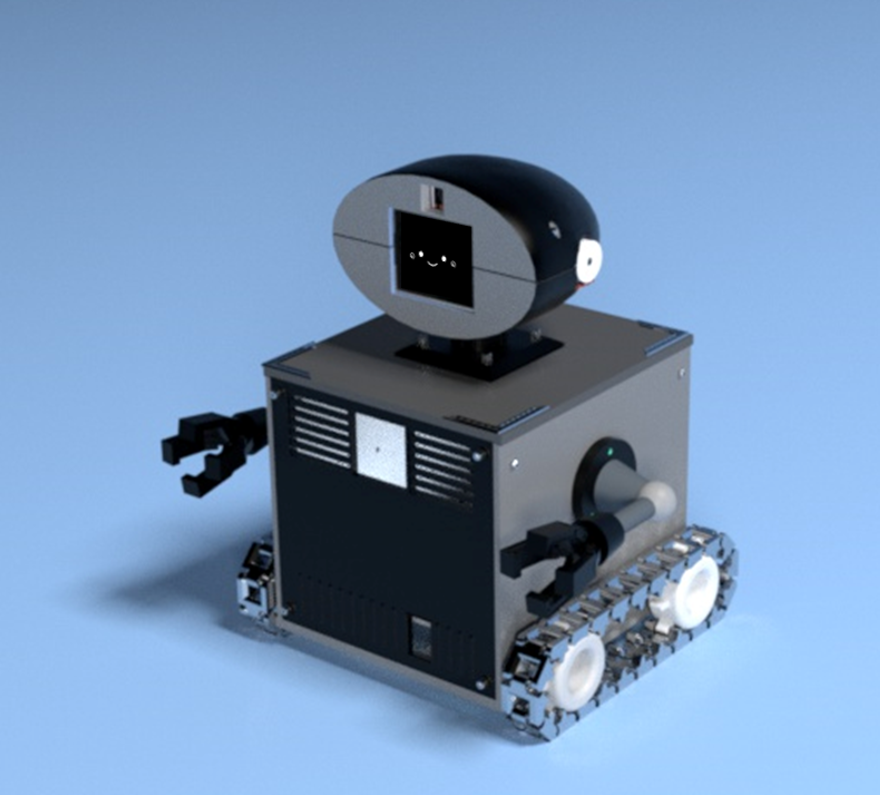
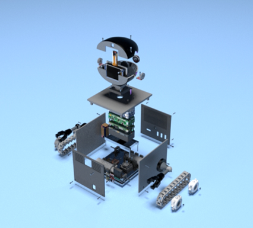
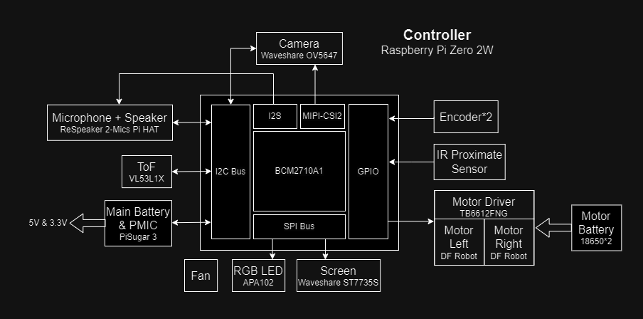
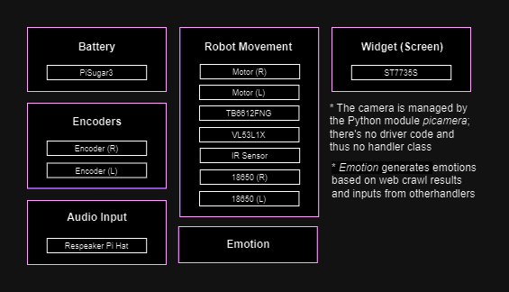
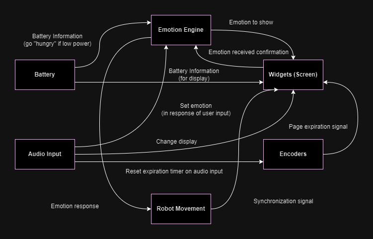
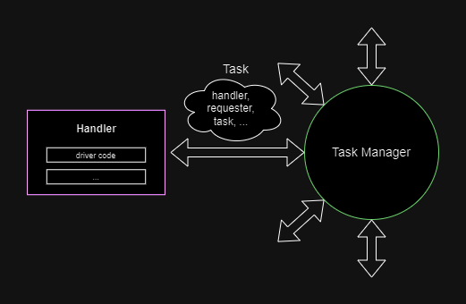
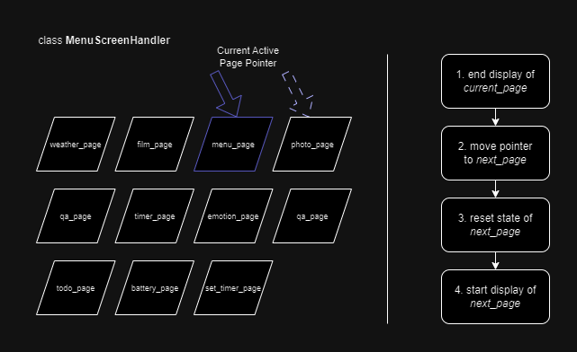

# PiBuddy

## Introduction
PiBuddy is a companion robot designed to assist you in daily tasks and keep you company. It features a variety of useful functions, such as a clock, timer, camera for taking photos and recording videos, and a to-do list to help you manage your day.

|   |   |
|-----------------------------------|-------------------------------------------------------------|

### Key Features:
* **Clock and Timer**

    Easily check the time or set reminders with PiBuddy’s built-in clock and timer features.

* **Photo and Video Capture** 
    
    PiBuddy allows you to take photos and record videos using voice commands or the rotary dial, making it convenient for capturing moments on the go.

* **To-Do List** 
    
    Stay organized with a simple to-do list that helps you keep track of tasks and priorities.

* **Voice and Rotary Dial Input** 

    PiBuddy accepts both voice commands and input through a rotary dial, giving you flexible options for interacting with the device.

* **Chat and Emotional Feedback** 

    Beyond its practical functions, PiBuddy engages with you in conversations and provides emotional responses, making it a comforting companion when you need a break or just want to chat.

PiBuddy serves as both a reliable productivity assistant and a friendly companion to help you manage your tasks and brighten your day.

## Hardware Components

*hardware block diagram of PiBuddy*

PiBuddy’s advanced features and interactivity are made possible by a combination of specialized hardware components, all working together to deliver a seamless and engaging user experience. Key components include:

1. **Controller: Raspberry Pi Zero 2W**

    We opted for the Raspberry Pi Zero 2W to achieve a more lightweight and compact design. Compared to our prototype that ran on a Raspberry Pi 4B, this choice reduced the board area by 40.97%, helping PiBuddy maintain a sleeker, more portable form factor while still providing sufficient processing power. The Raspberry Pi Zero 2W is the brain of PiBuddy, responsible for processing inputs, running the software, and controlling all connected hardware.

2. **Audiot IO: ReSpeaker 2-Mics Pi HAT**

    The ReSpeaker 20Mics Pi Hat is a low-power Raspberry Pi dual microphone expansion board designed for AI and voice application. It enables voice input and output, allowing users to interact with PiBuddy through speech, whether for commands or casual conversation.

3. **Rotary Encoders**

    Acting as user input knobs, the rotary encoders gives an intuitive, physical way to control PiBuddy’s functions. For a better user experience, we hand-printed the outer shells of the encoder knobs to match the aesthetics of PiBuddy's overall design, creating a cohesive and polished look.

4. **Motor Sensors: ToF (VL53L1X) and IR Proximity Sensors**

    The ToF and IR proximity sensors act as the "eyes" of PiBuddy, ensuring safe and efficient autonomous navigation. The ToF sensor measures the distance between PiBuddy and any surface in front of it, allowing the robot to detect and avoid obstacles. While the IR proximity sensor is less accurate than the ToF sensor, it is well-suited for its specific role in detecting drop-offs. Positioned towards the ground, the IR sensor helps PiBuddy identify if it’s approaching the edge of a table or elevated surface, preventing falls during movement.

5. **The Motor Set: Motors (DFRobot Motors), Motor Drivers (TB6612FNG), and Motor Battery (18650 Batteries)**

    PiBuddy’s movement is powered by two motors, allowing it to move smoothly and autonomously. While the Raspberry Pi’s GPIO pins control the motors, they can only supply a current of 16mA per pin, which is insufficient to power a DC motor directly. Motor drivers are used to provide the necessary current and control the direction of the motors. These drivers interpret commands from the Raspberry Pi to adjust the motors' speed and direction. To support the high energy demands of the motors, a dedicated motor battery is used as an additional power source.

6. **Screen (Waveshare ST7735S)**

    The Waveshare ST7735S screen display provides visual fedback, such as showing the time, weather, and task status, making interactions with PiBuddy more intuitive. We chose this screen due to its compact size, full-color LCD display, and frame rate of up to 200 fps, ensuring crisp and responsive visuals.

7. **Rechargeable Battery (PiSugar 3)**

    PiBuddy is powered by a rechargeable battery, which allows for mobility and ensures that you can use PiBuddy without being tethered to a power source. We chose a rechargeable option as it's more environmentally friendly compared to disposable batteries, aligning with our sustainability goals.

## Software Architecture

### The Idea
PiBuddy's software architecture is designed to ensure that its various hardware components can operate independently and concurrently while maintaining seamless interactions between them. We approached the design with several key considerations:

* **Concurrency with Multithreading and Multiprocessing** 
    
    PiBuddy’s hardware components require real-time and concurrent interaction. To achieve this, we implemented both multithreading and multiprocessing. This enables the components, such as the camera, screen, motors, and sensors, to function simultaneously without waiting for other tasks to complete. By isolating each major component in its own thread or process, we minimize latency and maximize responsiveness.

* **Modular Handler Classes for Component Groups** 

    Instead of treating each hardware component individually, we grouped components that work closely together into larger units. For example, the motor and sensor systems are controlled by a unified handler. Each handler class is responsible for managing the driving code of its respective component group, making the architecture more modular and easier to maintain.

    

    *handlers and their hardwre drivers*

* **Complex Graph of Component Interactions** 
    
    Through careful mapping of the component interactions, we discovered that the relationship between hardware groups is best represented as a complex graph rather than a simple ancestor-to-child tree. This architecture allows for flexible communication and coordination between the components, avoiding rigid hierarchies that would limit PiBuddy’s interactivity.

    

    *io relationship between main component groups*

* **Standardized Handler and Task Manager System** 
    
    To simplify communication between handlers, we designed a standardized task management system. The Task Manager acts as a central bus, routing tasks between handlers. This eliminates the need for custom handling logic for each communication pathway, ensuring that all components can easily share information through a unified protocol.

    

    *the standardized handler and task manager system*

* **Unified Handler Structure** 
    
    All handlers in PiBuddy follow a standardized structure with two core functions:

    * `listen()`: This is an always-running, infinite loop (while True) process that continuously listens for inputs from the hardware components. Based on the data it captures, it sends relevant tasks to the Task Manager.

    * `handle_task(args)`: This function is triggered by the Task Manager when a task is sent to a handler. It reads the task details and performs the necessary actions in response.
This consistent design allows for easy scaling and future development, ensuring that new components or features can be integrated without significant changes to the underlying architecture.

### Widget Handler and Pages
The Widget Handler is a special handler that administers multiple Page classes in addition to the screen driver. It manages the content displayed on PiBuddy’s physical screen and the functions delivered to users through screen. These pages include:

* **Battery Page** 
* **Emotion Page** 
* **Film Page**
* **Menu Page**
* **Photograph Page**
* **QA Page**
* **Set Timer Page**
* **Time Page**
* **Timer Page**
* **Todo Page**
* **Weather Page**

Each page class handles more than just rendering visuals. For instance, the Emotion Page not only displays emotions but also communicates with the Emotion Handler, signaling what is currently being shown. Therefore pages are instantiated when the Widget Handler is initialized, instead of when they are on display. Their display functions are designed to run and stop independently. Even if a page is not actively controlling the screen content, its instance remains "alive," ready to resume when needed.

The Widget Handler uses a multiprocess- and multithread-safe pointer to track the page currently displayed. When a task is received, the handler forwards it to the current page, where it is processed by the page’s own handle_task() method. The page then returns a dictionary to the Widget Handler, instructing it to either: (1) take no further action, (2) append a new task to the task manager, or (3) switch to a different page.

In the case of a page switch, the current page’s display loop is gracefully terminated via its handle_task() method. The switch signal is returned to the Widget Handler, which takes several steps: it updates the pointer to the next page, calls the reset_state() method on the new page to prepare its internal state, and then starts the new page’s display loop.

*the page switching mechanism*

The Widget Handler orchestrates seamless transitions between different pages, ensuring that the display is updated smoothly and that each page functions correctly while remaining responsive to new tasks.

## Data Management
PiBuddy manages user-generated content like photos, videos, and to-do lists using an SQL database for efficient organization and retrieval. The database consists of three main tables:

1. **`todo`**

    This table stores information about each task, including the task description, priority level, creation date, and the last update date. It helps users keep track of their tasks, prioritize them, and update their progress seamlessly.

2. **`saved_images`, `saved_videos`**
    
    These tables store metadata for each photo and video, including the file names, local file paths, and timestamps for when the files were created and last updated. This structure ensures that users can easily access and organize their media.

In addition to the standard data management functionality, PiBuddy features a reset option in the main program. This option allows for rewriting file paths for images and videos in cases where directories change, ensuring that data remains accessible even after folder transitions.

To preserve data for future analysis and potential performance optimization, all tables employ a soft-delete method. Instead of permanently deleting records, soft-deletion flags entries as inactive, allowing the data to remain in the system for future use, such as machine learning or historical analysis.

